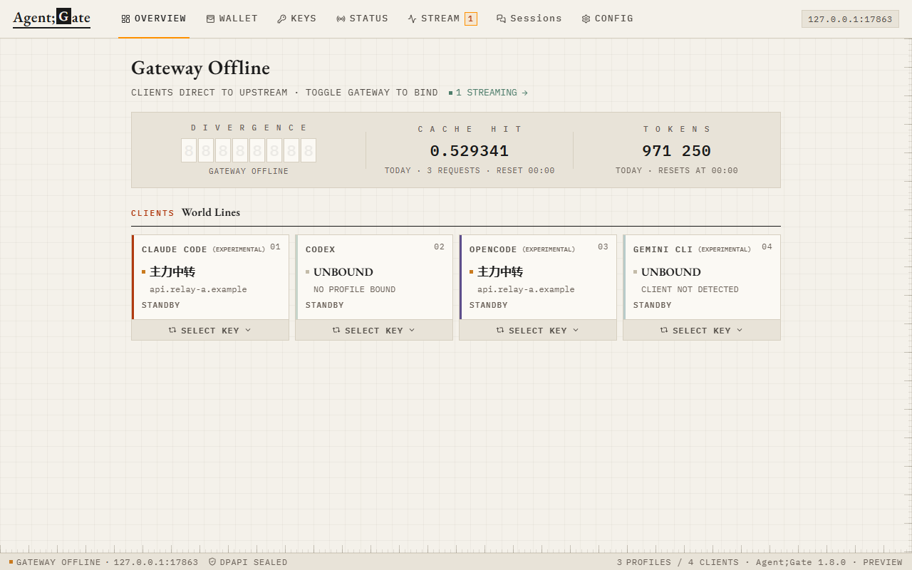
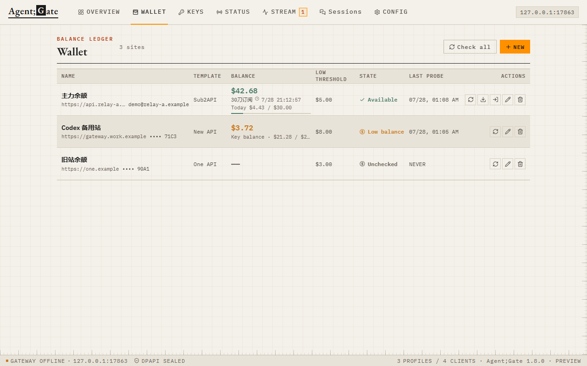
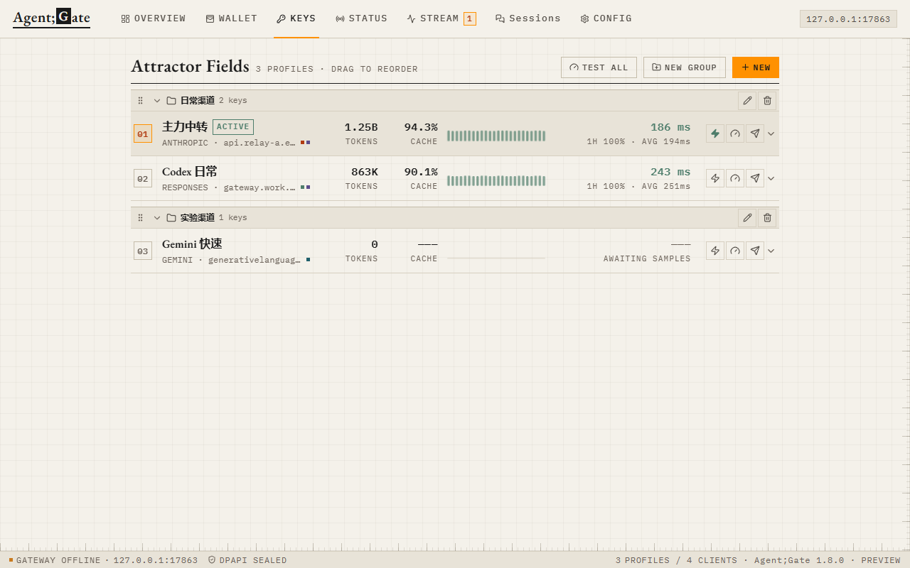
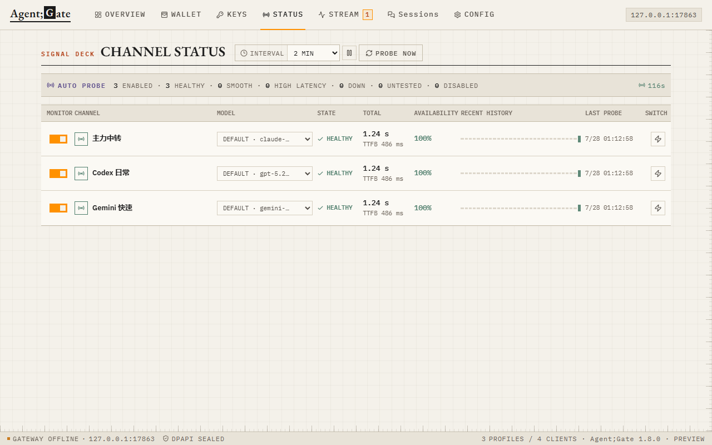
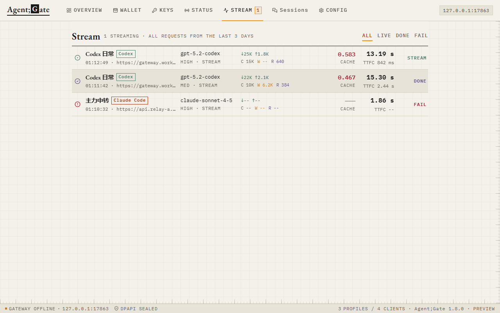
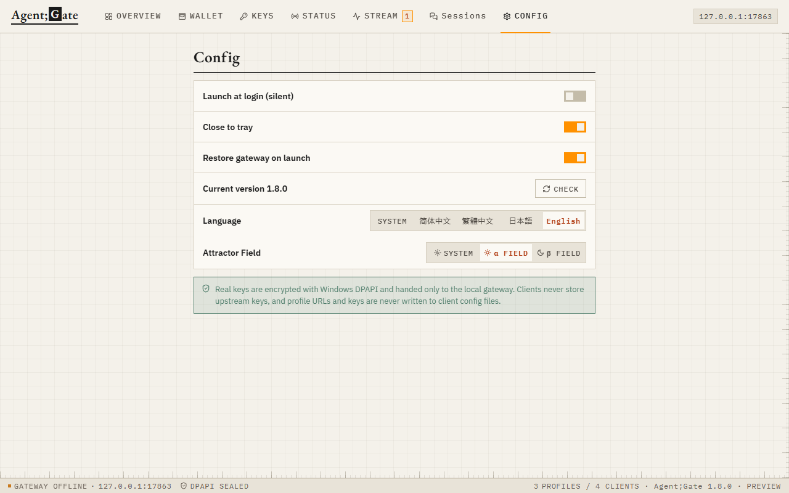

<div align="center">

# Agent;Gate

一个给 Windows 桌面 AI 客户端用的本地 API 密钥管理器和回环网关。

[简体中文](README.md) · [繁體中文](README.zh-TW.md) · [日本語](README.ja.md) · [English](README.en.md)

[](https://github.com/trygn35-ui/agentgate/releases/latest)
[](#下载)
[](LICENSE)

<picture>
  <source media="(prefers-color-scheme: dark)" srcset="docs/images/overview-dark.png">
  
</picture>

</div>

## 它解决什么

如果你同时用 Codex、Claude Code、OpenCode 或 Gemini CLI，又有多个官方 API 或中转渠道，最麻烦的通常不是发请求，而是反复改配置、找 Key、确认哪条线路还能用。

Agent;Gate 把这些事情收在一个本地应用里：

- 保存多组 API URL、Key、模型和备用端点，并用可折叠分组整理它们。
- 一个网关同时服务多个客户端，每个客户端有自己的路由，可以使用不同密钥。
- 客户端只连接 `127.0.0.1`，切换密钥时不必反复改客户端配置。
- 在独立钱包页查看中转站余额和每日订阅额度，并按需导入可用 Key。
- 用真实 Key 定时发送最小请求，查看可用率、耗时和最近检测记录。
- 实时查看请求状态、TTFB/TTFC、Token 与缓存命中。
- 浏览和删除 Claude Code、Codex、OpenCode 留在本机的会话。

它不是云服务，也不是共享代理。没有账号、服务器或遥测。

## 客户端支持

| 客户端 | 状态 | 协议 |
| --- | --- | --- |
| Codex | 稳定 | OpenAI Responses、Chat Completions |
| Claude Code | 实验性 | Anthropic Messages |
| OpenCode | 实验性 | Anthropic、OpenAI、Gemini |
| Gemini CLI | 实验性 | Gemini |

“实验性”表示这些客户端的配置格式仍可能变化。Agent;Gate 会尽量只修改自己负责的字段，并在断开接管时恢复，但升级客户端后仍建议先检查一次配置。

## 钱包与密钥分组

钱包目前支持 Sub2API、New API 和 One API 模板。Sub2API 可以在隔离的登录窗口里完成网页登录，余额每 5 分钟刷新，并显示真实的每日订阅额度和下一次重置时间。钱包统计与网关请求统计相互独立，只有点击导入时才会把支持的 Codex/OpenAI 或 Claude/Anthropic Key 写入密钥页。

导入时会按钱包名称创建或选择分组；不支持的平台会跳过，单个 Sub2API 账号超过 500 把 Key 时会直接拒绝导入。密钥页支持创建、重命名、删除、展开和收起分组，也可以拖动分组或方案即时调整顺序。

## 渠道状态

自动检测默认每 2 分钟执行，也可以选择 5 或 10 分钟。检测使用固定时钟；点击“立即检测”不会推迟下一次自动检测。

| 结果 | 判定 |
| --- | --- |
| 正常 | 成功，耗时不超过 5 秒 |
| 流畅 | 成功，耗时大于 5 秒且不超过 10 秒 |
| 延迟 | 成功，耗时超过 10 秒 |
| 故障 | 请求失败、超时或返回不可用结果 |

每个渠道都能单独关闭监测、选择检测模型，并从状态页直接切换为当前密钥。

## 下载

前往 [Releases](https://github.com/trygn35-ui/agentgate/releases/latest)：

| 文件 | 用途 |
| --- | --- |
| `AgentGate-Setup-<version>-x64.exe` | 安装版，支持应用内更新，推荐 |
| `AgentGate-Portable-<version>-x64.exe` | 便携版，不写安装目录，不支持自动替换自身 |
| `SHA256SUMS-<version>.txt` | SHA-256 校验值 |

要求 Windows 10 1809+ 或 Windows 11，x64。

当前构建没有商业代码签名证书，Windows SmartScreen 可能显示“未知发布者”。可以核对 Release 中的 SHA-256 后选择“更多信息 → 仍要运行”。

## 快速开始

1. 在“密钥”页新建方案。默认协议是 OpenAI Responses，填写上游 URL、Key 和模型。
2. 选择这个方案要服务的客户端。
3. 在“概览”或“状态”页把方案切换给对应客户端。
4. 点击客户端卡片接管。之后客户端仍按原方式使用，请求会经过本地网关。

断开接管时，Agent;Gate 会恢复自己修改过的配置字段。切换不同方案只更新网关路由，不会打断已经发出的请求。

```text
Claude Code ─┐
Codex ───────┤
OpenCode ────┼──> 127.0.0.1:17863 ──> 各客户端独立路由 ──> 不同上游
Gemini CLI ──┘
```

## 数据与安全

- Key 使用 Windows DPAPI 加密，保存于当前 Windows 用户的数据目录。
- 上游 URL 和真实 Key 不写入客户端配置；客户端只保存本地地址和随机本地凭据。
- 网关只监听回环地址，不向局域网开放。
- 动态记录只保存请求元数据，不保存提示词、回复正文或会话内容。
- 会话页直接读取各客户端自己的本地数据库；删除前会展示计划，删除不可恢复。
- Sub2API 登录使用独立的临时 Electron 会话，只允许目标站点和官方 OAuth HTTPS 跳转；窗口关闭后会清理 Cookie、缓存和认证数据。
- 导入的钱包会话令牌使用 Windows DPAPI 加密。Refresh Token 过期或被站点撤销后，需要重新登录。

数据目录：

```text
%APPDATA%\agentgate\data\
├── profiles.json
├── gateway.json
├── gateway-recovery.json
├── settings.json
├── requests.json
├── wallets.json
└── window-state.json
```

## 截图

<details open>
<summary>概览</summary>
<br>
<picture>
  <source media="(prefers-color-scheme: dark)" srcset="docs/images/overview-dark.png">
  
</picture>
</details>

<details>
<summary>钱包</summary>
<br>
<picture>
  <source media="(prefers-color-scheme: dark)" srcset="docs/images/wallet-dark.png">
  
</picture>
</details>

<details>
<summary>密钥管理</summary>
<br>
<picture>
  <source media="(prefers-color-scheme: dark)" srcset="docs/images/keyring-dark.png">
  
</picture>
</details>

<details>
<summary>渠道状态</summary>
<br>
<picture>
  <source media="(prefers-color-scheme: dark)" srcset="docs/images/status-dark.png">
  
</picture>
</details>

<details>
<summary>请求动态</summary>
<br>
<picture>
  <source media="(prefers-color-scheme: dark)" srcset="docs/images/activity-dark.png">
  
</picture>
</details>

<details>
<summary>设置</summary>
<br>
<picture>
  <source media="(prefers-color-scheme: dark)" srcset="docs/images/settings-dark.png">
  
</picture>
</details>

## 开发

需要 Node.js 22 和 pnpm。

```powershell
pnpm install --frozen-lockfile
pnpm test
pnpm dev
pnpm dist
pnpm release
```

Electron 主进程负责文件写入、DPAPI 和网关；React 渲染进程没有直接文件系统权限。

## 许可

[MIT](LICENSE)
